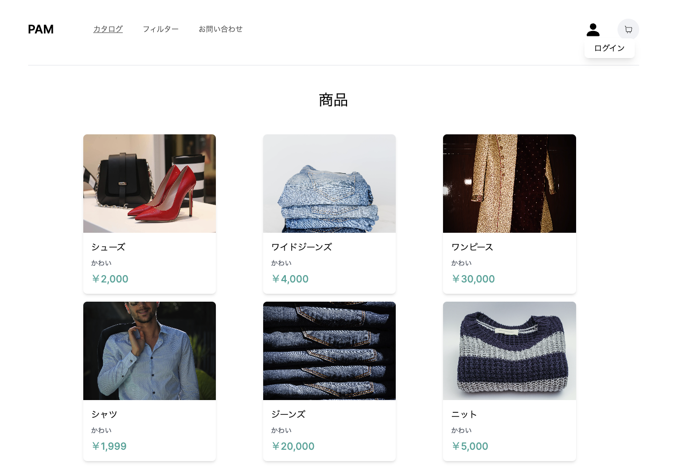

# 🌅 　 TopPage

# 🔧 　使用技術

- Next.js: 13.4.19(フレームワーク)

- React: 18.2.0

- Prisma: 5.5.2(DB 連携)

- TypeScript: 5.2.2(プログラミング言語)

- Next-Auth: 4.23.1(認証)

- Tailwind CSS: 3.3.3(スタイル)

- Stripe: 13.7.0(決済)

# 🌐 　 App URL

### **https://clothing-ec.vercel.app/**

# 👭 　テスト用アカウント

メールアドレス：test@mail.com

パスワード：test1111

# 🌊 　概要

PAM は個人でアパレルブランドを運営している方、心を込めて作成した商品をたくさんの方々に届けたいが認知度が低く商品を届けられない方、宣伝が上手くできずに商品を届けられない方を支援するアプリケーションです。

アカウントを作成すればすぐに自分の商品を出品することができます。

また、他の人が作成した商品を購入することができます。

# 🐶 　制作背景

私は、<a href="https://chillde.com/">Chillde</a>という幼馴染が運営しているアパレルブランドに携わっています。宣伝場所は主に Instagram ですが、その他、X や Tiktok なども使用してブランド拡大を目指してきました。しかし、中々知名度が上がらず、たくさんの方々に商品を届けられていないことが現状です。<br/>
大学 2 年生の 2 月から携わっていますが、身をもってアパレルブランド経営の難しさに直面しました。

そこで、私たちと同じように宣伝などが上手くいかずに心を込めて作成した商品を届けられない方がいるのではないかと考えました。そこで、この様な人たちの助けになり、できるだけ多くの人に作成した商品を届けたいと考え、このアプリケーションを作成しました。

# 📚 　アプリの利用方法

1.<a href="https://clothing-ec.vercel.app/">PAM</a>にアクセスします。

2.右上の人型アイコンをクリックしてアカウントを作成します。


3.アカウントを作成すれば作成した商品の出品をすることができます。

4.商品の購入をすることもできます。

# 🔨 　今後実装したい機能

- お気に入り登録の追加

- カラーでのフィルタリング

- 洋服の名前を検索したらヒットするような機能の追加

- それぞれのアパレルブランドのページを作成する

- ユーザー個人の専用ページを作成し、購入履歴やお気に入り登録した商品を見れる様にする

- レスポンシブ対応を細かく作成する

# 📝 　スライド資料

<a href="https://docs.google.com/presentation/d/13DuybtLy9CJ3OvjskLzq8xLhCuuxpw_7-YHbmfiaUPI/edit?usp=sharing">スライド資料</a>

↑
上のスライドは PAM についての詳細を記載しております。

## Requirements

```
node 18.16.1
TypeScript 5.2.2
```

## Downloading and installing steps

1. Clone the repository

```
git clone https://github.com/kawai-ota/clothing-EC.git
```

2.Go into the repository

```
cd clothing-EC
```

3.Install dependencies

```
npm install
```

4.Run the app

```
npm start
```
